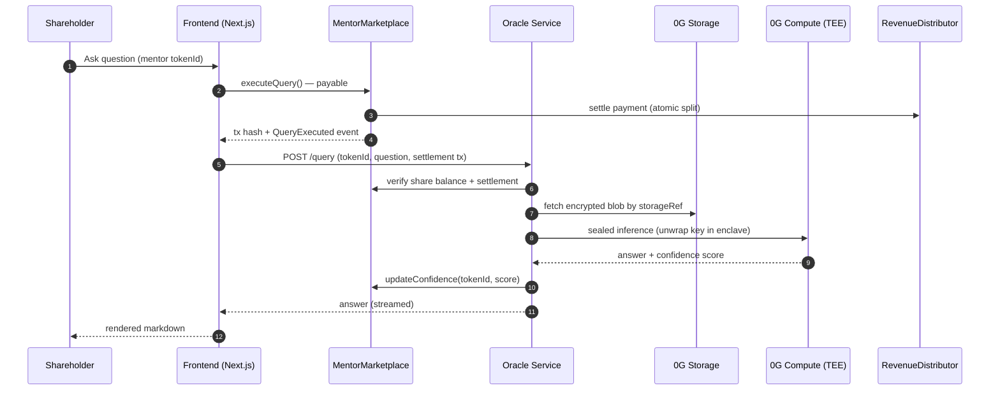

<p align="center">
  
</p>

<h1 align="center">AIMentor.X</h1>

<p align="center">
  <strong>The first marketplace for knowledge that isn't on the internet.</strong><br/>
  Experts mint themselves as Intelligent NFTs. Fans co-own the upside. No operator.
</p>

<p align="center">
  
  
  
  
  
</p>

<p align="center">
  <a href="#">Live Demo</a> ·
  <a href="#how-it-works">How It Works</a> ·
  <a href="#architecture">Architecture</a> ·
  <a href="#0g-integration">0G Integration</a> ·
  <a href="#local-development">Run Locally</a>
</p>

---

## Overview

AIMentor.X is a marketplace for the knowledge that is **deliberately not on the internet** — regulatory tactics, founder playbooks, deal mechanics, insider patterns. Experts mint themselves as **Intelligent NFTs** on 0G Chain, fans buy fractional **access shares** along a bonding curve, and every query is answered inside a **TEE on 0G Compute** so even the operator can never read the knowledge base.

Built end-to-end on **0G's modular AI x Web3 stack** — agents are minted as iNFTs (ERC-7857) on 0G Chain, knowledge is encrypted and Merkle-rooted on 0G Storage, inference is sealed and attested on 0G Compute, and revenue flows through a non-custodial royalty + vesting escrow.

- **Identity** — mentors minted as iNFTs (ERC-7857) on 0G Chain with `iTransfer` / `iClone` multi-proof transfer
- **Memory** — encrypted knowledge stored on 0G Storage (KV for active context, Log for archive); only the root hash is on-chain
- **Verification** — sealed inference inside a TEE on 0G Compute; the sealed key is unwrapped only inside the enclave
- **Execution** — bounded revenue distribution: queries pay an atomic split (mentor royalty + pro-rata shareholder dividend), vesting handled by a 0G escrow contract

---

## The Problem

Today, the most valuable knowledge sits in a few hundred heads and has no monetization path that preserves the expert's reputation **and** scales beyond their calendar.

> **The expertise that compounds the most is the expertise you cannot publish.**

| Today's option | Why it fails |
|---|---|
| Paid consulting / mentorship | Time-bound, doesn't scale, no asset value |
| Online courses (Udemy, Maven) | Static, public the moment they ship, instantly stale |
| Friend.tech-style social tokens | Pure speculation, no underlying utility, no upgrade path |
| LLM fine-tunes on private data | Operator can exfiltrate; no royalty path; no privacy guarantee |

AIMentor.X is the first design where the expert earns **forever**, the fan owns **economic upside**, and the learner gets **verifiable confidentiality** — in a single primitive.

---

## How It Works

> Scenario: a former regulator has 12 years of tactical insight into Indonesian compliance loopholes. She cannot publish it. AIMentor.X lets her tokenize it.

1. **Mint Mentor iNFT** — she connects her wallet, mints an `AIMentorINFT` (ERC-7857), retaining 50% of initial shares.
2. **Upload Encrypted Knowledge** — her framework is encrypted client-side, uploaded to 0G Storage; only the Merkle root (`storageRef`) is anchored on-chain.
3. **Bonding Curve Trading** — fans buy access shares through `AccessSharesMarket`; price rises monotonically on each buy.
4. **Sealed Query** — a shareholder asks a question. The oracle service verifies their share balance, fetches the encrypted blob, unwraps the sealed key **inside the TEE**, runs inference, returns the answer.
5. **Confidence Signal** — the LLM self-reports confidence; if below threshold, `gapCount` is incremented on-chain — a public sell signal.
6. **Atomic Settlement** — `executeQuery` is `payable`; `RevenueDistributor` splits the payment into vested mentor royalty + pro-rata shareholder dividend in a single transaction.
7. **Mentor Patches the Gap** — she sees the public gap, uploads an addendum, `storageRef` is updated, `gapCount` resets. Share price recovers.

**Result:** mentors earn royalty forever, shareholders own a productive asset that improves over time, learners get tactical intelligence that cannot be screenshotted off the internet.

---

## Architecture

### Query Flow



### System Components

```mermaid
flowchart LR
    subgraph CLIENT["Client Surface"]
        FE[Next.js 16<br/>RainbowKit · viem · wagmi]
    end

    subgraph CONTRACTS["0G Chain — Contracts"]
        MP[MentorMarketplace]
        INFT[AIMentorINFT<br/>ERC-7857]
        SH[AccessSharesMarket<br/>Bonding Curve]
        RD[RevenueDistributor]
        VE[VestingEscrow]
    end

    subgraph SERVICE["Oracle Service"]
        QR[/query]
        UP[/upload]
        OC[/oracle]
        MK[/market]
    end

    subgraph ZG["0G Stack"]
        STORE[(0G Storage<br/>KV + Log)]
        TEE[(0G Compute<br/>Sealed TEE Inference)]
    end

    FE --> MP
    FE --> SH
    FE --> SERVICE

    UP --> STORE
    UP --> INFT

    QR --> MP
    QR --> STORE
    QR --> TEE
    QR --> INFT

    OC --> INFT

    MP --> SH
    MP --> RD
    MP --> VE
    RD --> VE
```

---

## The Three Actors

| Actor | Stake | Earns | Loses If |
|---|---|---|---|
| **Mentor** | Mints iNFT, retains 50% initial shares, uploads knowledge | Per-query royalty (vested 30d) + capital gain on retained shares | Confidence falls → gap count rises → vesting slows / claws back |
| **Shareholder** | Buys shares on bonding curve | Pro-rata cut of every query + capital gain on share price | Mentor ghosts → public `gapCount` signal → exit on curve |
| **Learner** | Pays per query (or holds 1 share for subscription) | Private, verifiable, continuously-updating tactical knowledge | Knowledge stale — signaled on-chain by `gapCount` |

> Every actor wins **only when the loop spins**. Compromising any single actor cannot drain the system.

---

## 0G Integration

AIMentor.X is structurally inseparable from the 0G stack. Removing any one of the four primitives breaks a core invariant — there is no "AWS fallback" path.

| 0G Layer | How AIMentor.X Uses It | Files |
|---|---|---|
| **0G Chain** | All 6 contracts deployed on mainnet `16661`. iNFT custody, bonding curve, atomic revenue split, vesting, and oracle signaling all settle here. | `sc/src/*.sol` |
| **0G Storage** | Mentor knowledge encrypted client-side and pushed to `indexer-storage-turbo.0g.ai`; root hash anchored on-chain in `AIMentorINFT.storageRef`. KV for live updates, Log for immutable archive. | `be/src/lib/storage.ts`, `be/src/routes/upload.ts` |
| **0G Compute (TEE)** | Inference runs inside a TEE-attested provider on 0G Compute. The sealed key for the mentor's knowledge is unwrapped **only inside the enclave** — never exposed to the oracle host or the GPU operator. Provider auto-funding handled programmatically. | `be/src/lib/compute.ts`, `be/src/routes/query.ts` |
| **ERC-7857 iNFT** | Mentor identity + sealed-key custody. `iTransfer` and `iClone` with multi-proof validation allow ownership transitions without leaking the underlying knowledge — a mentor can sell their iNFT without the buyer having to trust the seller. | `sc/src/AIMentorINFT.sol` (464 LOC), `sc/src/IERC7857.sol` |

### Why 0G, not AWS + Ethereum

A naïve build would put contracts on Ethereum, knowledge on S3, and inference behind an OpenAI API. That stack fails on three simultaneous guarantees this product requires:

| Requirement | AWS + Ethereum | 0G |
|---|---|---|
| Knowledge uncensorable | ❌ S3 can revoke / get subpoenaed | ✅ Log layer, Merkle-rooted |
| Access trustless | ⚠️ Possible, but storage gating off-chain | ✅ Smart contract is the gate |
| Inference tamper-proof | ❌ OpenAI / cloud LLM is a black box | ✅ TEE attestation, sealed key |

If any one fails, the mentor will not entrust sensitive knowledge to the platform. 0G is the only stack where all three are first-class primitives.

---

## Key Security Primitive — Sealed Key Custody

The mentor's knowledge is encrypted with a key that is **never** held by the platform operator. The key is sealed against the TEE's attestation report, so it can only be unwrapped inside an enclave running the canonical inference binary.

```text
UPLOAD                                QUERY
──────                                ─────
plaintext                             encrypted blob (from 0G Storage)
    │                                       │
    ▼                                       ▼
encrypt(key)                             ┌──────────────────┐
    │                                    │  0G Compute TEE  │
    ▼                                    │  ──────────────  │
[encrypted blob] → 0G Storage            │  unwrap(sealed)  │
seal(key → TEE)  → AIMentorINFT          │  decrypt(blob)   │
    │                                    │  LLM.infer()     │
    ▼                                    └────────┬─────────┘
storageRef + sealedKey on-chain                   ▼
                                          answer + confidence
                                                  │
                                                  ▼
                                         updateConfidence on-chain
```

**Invariant:** the oracle host machine, the GPU operator, and any indexer can each read the encrypted blob — none can read the plaintext. Only a TEE running the attested binary can.

### Bounded Execution

Agents (oracle workers) reason; only the **on-chain contract** can move funds. Even a compromised oracle key cannot drain the system — it can only update confidence scores and increment gap counts.

| Trigger | Action |
|---|---|
| User calls `executeQuery` (payable) | `MentorMarketplace` atomically settles to `RevenueDistributor` |
| Oracle posts low confidence | `incrementGapCount` increments a counter — no fund movement |
| Mentor patches knowledge | `updateStorageRef` rotates the encrypted blob pointer |

> The oracle has no withdraw permission. Even if the oracle key leaks, no funds move.

---

## 0G APAC Hackathon 2026

Submission to the **0G APAC Hackathon** (March–May 2026), targeting **Track 4: Web 4.0 Open Innovation** (SocialFi / Consumer App) with crossover relevance to **Track 3: Agentic Economy** and **Track 5: Privacy & Sovereign Infrastructure**.

| Hackathon Requirement | Where to Find It |
|---|---|
| 0G mainnet contract addresses | See [Deployed Contracts](#deployed-contracts) |
| 0G Explorer link / on-chain activity | All contracts viewable on `https://chainscan.0g.ai` |
| 0G core component integration | 0G Chain (6 contracts) · 0G Storage (encrypted knowledge) · 0G Compute (TEE inference) · ERC-7857 iNFT |
| Demo video (≤3 min) | Linked from [Live Demo](#) |
| Architecture & docs | This README |
| Local reproduction steps | See [Local Development](#local-development) |

**Why AIMentor.X fits the 0G thesis:** the product depends on every flagship 0G primitive — chain, storage, compute, agent identity, sealed execution — to make a non-custodial expert marketplace possible. Without 0G, there is no verifiable knowledge gating, no private inference, and no transferable AI identity.

---

## Deployed Contracts — 0G Mainnet (Chain ID 16661)

| Contract | Address | Purpose |
|---|---|---|
| `MentorMarketplace` | `<TBD_MARKETPLACE>` | Orchestrator: mint, query settlement, oracle hub |
| `AIMentorINFT` | `<TBD_INFT>` | ERC-7857 iNFT: mentor identity + sealed key custody |
| `AccessSharesMarket` | `<TBD_SHARES>` | Bonding curve trading for access shares |
| `RevenueDistributor` | `<TBD_REV>` | Atomic per-query royalty + dividend split |
| `VestingEscrow` | `<TBD_VEST>` | 30-day vesting + claw-back on gap escalation |

**Demo:** first mentor minted → tokenId `<TBD>` · first paid query → tx `<TBD_TX>`

---

## What's Shipped

```
sc/    6 contracts · 1,093 LOC Solidity · Foundry · OZ submodule · 510 LOC tests
fe/    Next.js 16 · React 19 · viem · wagmi · RainbowKit · three.js · 7 surfaces
be/    Express · ethers v6 · zod · 0G SDKs · routes: upload · query · oracle · market
```

- 6 mainnet contracts on 0G Chain `16661`
- ERC-7857 iNFT with `iTransfer` / `iClone` and multi-proof validation
- Encrypted upload pipeline → 0G Storage with on-chain `storageRef` anchoring
- TEE inference pipeline through 0G Compute with provider auto-funding
- On-chain AI confidence oracle (`gapCount`, `confidenceScore`)
- Share-gated chat with markdown rendering, live polling, mentor activity feed
- Bonding curve pricing, atomic revenue distribution, vesting escrow
- 7 production dashboards: marketplace, my-mentors, my-shares, earnings, gap-reports, security-logs, mentor workspace

---

## Repository Layout

```
aimentor/
├── sc/                              Solidity contracts (Foundry)
│   ├── src/
│   │   ├── AIMentorINFT.sol         ERC-7857 mentor iNFT (464 LOC)
│   │   ├── MentorMarketplace.sol    Orchestrator
│   │   ├── AccessSharesMarket.sol   Bonding curve
│   │   ├── RevenueDistributor.sol   Atomic per-query split
│   │   ├── VestingEscrow.sol        30-day vesting + claw-back
│   │   └── IERC7857.sol             Standard interface
│   ├── test/MentorMarketplace.t.sol (510 LOC)
│   └── script/Deploy.s.sol
├── fe/                              Next.js 16 frontend
│   └── src/app/(dashboard)/         marketplace · my-shares · my-mentors ·
│                                    earnings · gap-reports · security-logs
└── be/                              Oracle service
    └── src/routes/                  upload · query · oracle · market
```

---

## Local Development

### Smart contracts

```bash
cd sc
forge install
forge build
forge test
forge script script/Deploy.s.sol --rpc-url 0g_mainnet --broadcast
```

Env: `PRIVATE_KEY` (deployer).

### Oracle service

```bash
cd be
npm install
cp .env.example .env
npm run dev
```

Env: `ZG_RPC_URL`, `ORACLE_PRIVATE_KEY`, `CONTRACT_INFT`, `CONTRACT_MARKETPLACE`, `CONTRACT_SHARES`, `CONTRACT_REVENUE`, `CONTRACT_VESTING`.

### Frontend

```bash
cd fe
npm install
npm run dev
```

App on `localhost:3000`, default chain 0G Mainnet (`16661`).

---

## Developer Feedback for 0G

Notes from building on the 0G stack — submitted as constructive feedback to the team:

- **Storage indexer + RPC pairing:** the `RPC_URL` + `indexer-storage-turbo.0g.ai` relationship is implicit; explicit configuration docs would shorten onboarding.
- **Compute provider auto-funding:** the broker can fail silently on low balance; surfacing a structured `INSUFFICIENT_BALANCE` error would speed integration.
- **ERC-7857 examples:** multi-proof construction for `iTransfer` / `iClone` is non-obvious; a canonical reference implementation alongside the EIP would help adoption.
- **TEE attestation surface:** there is no straightforward way to expose the attestation report to the end user from the frontend SDK; this would meaningfully strengthen trust UX.

---

## Roadmap Post-Hackathon

1. **Q2 2026** — TEE attestation surfaced to user UI; permissionless mentor onboarding; mobile-first share trading.
2. **Q3 2026** — Knowledge composability (mentor-of-mentors via `iClone`); on-chain reputation; multi-language support.
3. **Q4 2026** — Institutional vault product: a curated basket of top mentors as a single iNFT, traded as one share.

---

## Team

| | Role |
|---|---|
| **Dimas** | Product, GTM, design, narrative |
| **Faisal** | Smart contracts, full-stack, 0G integration |

---

## License

MIT. Built for the 0G APAC Hackathon, May 2026.
