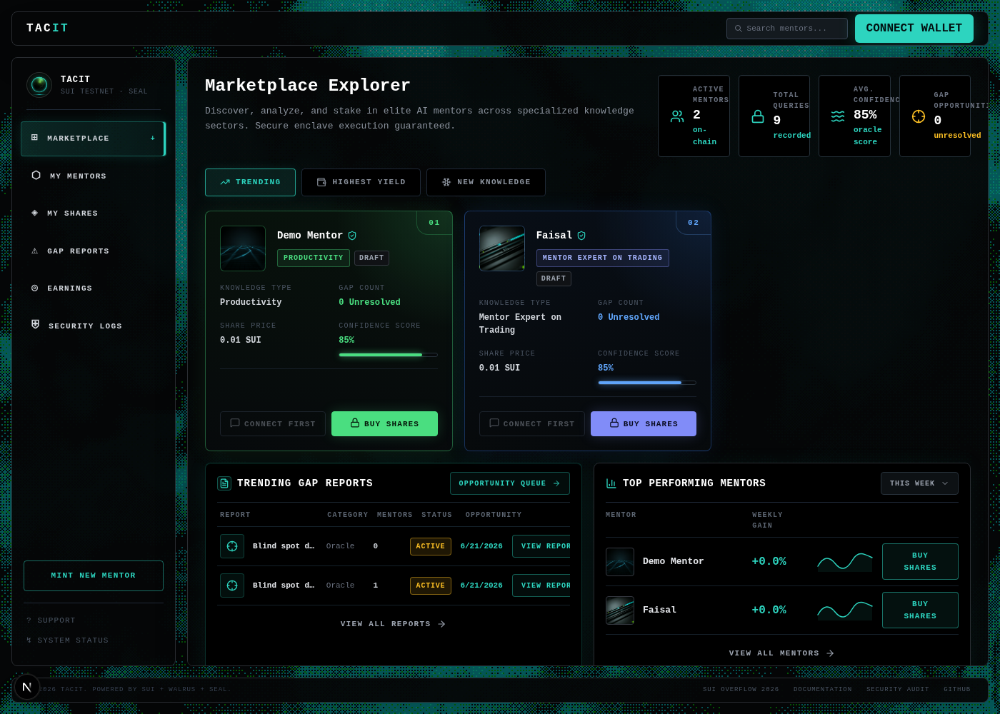
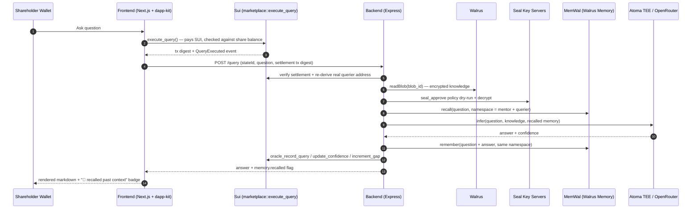
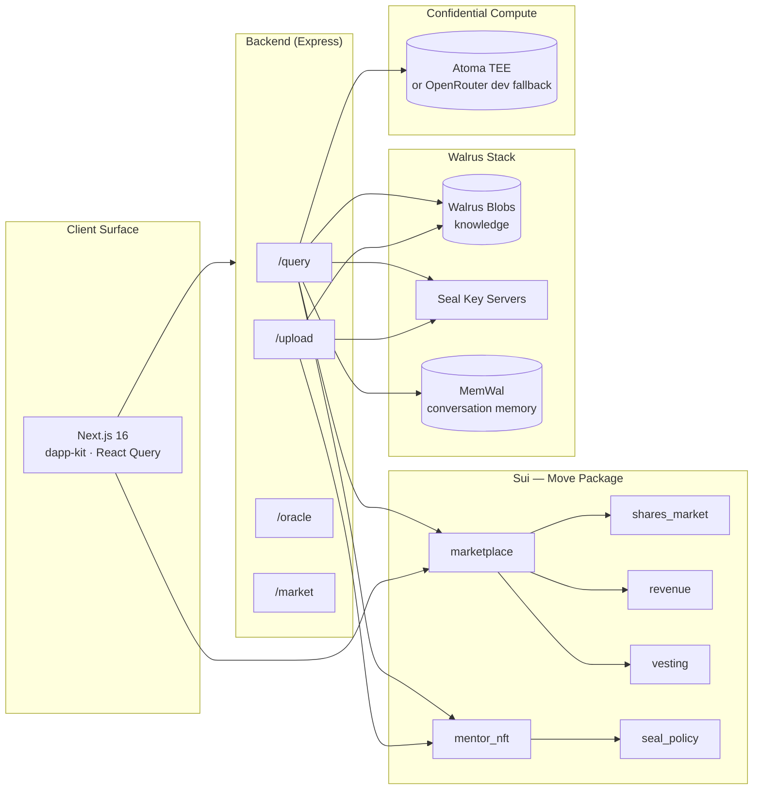

<p align="center">
  
</p>

<h1 align="center">Tacit</h1>

<p align="center">
  <strong>Persistent AI mentors powered by Walrus memory.</strong><br/>
  Private expert knowledge, cross-session agent memory, and Sui-native access control.
</p>

<p align="center">
  
  
  
  
  
  
</p>

<p align="center">
  <a href="#">Live Demo</a> ·
  <a href="#how-it-works">How It Works</a> ·
  <a href="#architecture">Architecture</a> ·
  <a href="#walrus-integration">Walrus Integration</a> ·
  <a href="#local-development">Run Locally</a>
</p>

---

## Overview

Tacit is a persistent AI mentor protocol built for the **Sui Overflow 2026 Walrus Track**. Each mentor is an agent with two durable data layers: encrypted expert knowledge stored as **Walrus** blobs, and cross-session conversation memory stored through **MemWal (Walrus Memory)**.

The core idea is simple: an AI mentor should not reset every time a user opens a new session. It should remember prior conversations, reuse private files over time, and operate on data that is portable, persistent, and independently verifiable. Tacit makes that possible by putting the mentor's knowledge and memory on Walrus, then using Sui and Seal to control who can decrypt and use it.

On top of that memory layer, Tacit adds a marketplace incentive system. Experts mint themselves as **on-chain AI mentors** on Sui, users buy fractional **access shares**, and every query pays into an atomic revenue split. The tokenomics are not the product's trust layer; they are the mechanism that keeps mentors updating their knowledge as gaps are discovered.

Built on the **Sui + Walrus + Seal + Atoma** stack: mentor identity lives as a Move object on Sui, knowledge is encrypted and stored on **Walrus**, decryption is authorized by an on-chain **Seal** policy (share balance, oracle, or allow-list, enforced by Seal's key-servers, not by Tacit), inference is architected to run inside **Atoma**'s confidential-compute network (swappable to an OpenRouter dev fallback, see [Compute Provider](#compute-provider), while Atoma's enterprise access process is pending), and every conversation is remembered across sessions via **MemWal**.

- **Identity** — mentors minted as a `MentorNFT` (owned object) paired with a shared `MentorState` on Sui; transfer/clone are plain Move calls, no oracle proof required
- **Knowledge** — encrypted client-side via Seal, stored as a blob on Walrus; only the blob id is anchored on-chain
- **Cross-session memory** — every query + answer for a given `(mentor, querier)` pair is written to **MemWal**, and recalled before the next answer — mentors remember *you*, not just their static knowledge base
- **Access control** — Seal's `seal_approve` policy checks share balance, oracle address, or allow-list directly on-chain; the backend never hands out a key
- **Execution** — bounded revenue distribution: queries pay an atomic split (60% mentor / 25% curators / 15% platform), vesting handled by an on-chain schedule with stale-period clawback

---

## The Problem

Most AI agents are still brittle because their memory is local, temporary, and trapped inside one app. They can answer a task, but they rarely build durable context across sessions, share state across workflows, or reuse files in a way that users and developers can verify.

That problem is sharper for private expert knowledge. The most valuable expertise often cannot be published: regulatory tactics, founder playbooks, deal mechanics, internal operating patterns. If an AI agent is going to use that knowledge, it needs more than a prompt and a database. It needs persistent storage, policy-gated access, and memory that survives across sessions.

| Today's option | Why it fails |
|---|---|
| Plain chatbot wrappers | No durable memory; every conversation starts from zero |
| App-specific agent memory | Locked into one tool, model, or vendor |
| Centralized file storage | Data can be revoked, hidden, or silently changed |
| LLM fine-tunes on private data | Operator can exfiltrate; no clear access policy or royalty path |
| Online courses / static content | Public, stale, and disconnected from user-specific context |

Tacit turns that into a working Walrus-native agent system: private knowledge lives as encrypted Walrus data, user-specific mentor memory lives in MemWal, and Sui + Seal enforce who can access it. The result is an AI mentor that can remember, improve, and remain portable instead of becoming another stateless chatbot.

---

## How It Works

> Scenario: a former regulator has 12 years of tactical insight into Indonesian compliance loopholes. She cannot publish it. Tacit lets her tokenize it.

1. **Register Mentor** — she connects her wallet, calls `marketplace::register_mentor`, minting a `MentorNFT` + `MentorState` + `SharePool` + `RevenuePool` + `VestingSchedule` in one signed transaction. She retains the initial share allocation.
2. **Upload Encrypted Knowledge** — her framework is encrypted via **Seal** (identity = her mentor's `MentorState` id) and stored as a blob on **Walrus**; only the blob id is anchored on-chain.
3. **Bonding Curve Trading** — fans buy access shares through `shares_market`; price rises monotonically on each buy.
4. **Gated Query** — a shareholder asks a question. The backend verifies on-chain settlement and share balance, downloads the blob from Walrus, and Seal's key-servers authorize decryption directly against the on-chain policy.
5. **Memory Recall** — before answering, the backend recalls past exchanges between *this specific querier and this mentor* from **MemWal** — the mentor remembers last week's conversation, not just its static knowledge.
6. **Confidential Inference** — the question, knowledge, and recalled memory go to **Atoma**'s confidential-compute network (or an OpenRouter dev fallback when Atoma access is pending — see [Compute Provider](#compute-provider)).
7. **Confidence Signal** — the model is instructed to lead its reply with a literal, language-independent tag when it can't answer confidently; if so, `gap_count` is incremented on-chain — a public sell signal.
8. **Atomic Settlement** — `execute_query` is paid in SUI; `revenue` splits the payment into mentor royalty + pro-rata curator dividend in the same transaction.
9. **Memory Write** — the exchange is written back to MemWal, so the mentor remembers it next time this same user asks something — in a different session, a different day.
10. **Mentor Patches the Gap** — she sees the public gap, re-uploads an addendum; the blob id updates and one open gap resolves. Share price recovers.

**Result:** mentors earn royalty forever, shareholders own a productive asset that improves over time, learners get tactical intelligence that cannot be screenshotted off the internet — answered by an agent that actually remembers them.

---

## Architecture

### Query Flow



### System Components



---

## Walrus Integration

Tacit uses Walrus for **two distinct, independently-encrypted data flows** — not just file storage:

| Data | What it is | Storage | Encryption | Lifetime |
|---|---|---|---|---|
| **Knowledge** | The mentor's static expertise (text/files they upload) | Walrus blob, id anchored in `MentorState.blob_id` | Seal, identity = `MentorState` object id; policy = share-balance OR oracle OR allow-list | Until the mentor re-uploads |
| **Memory** | Every `(question, answer)` exchange for a specific `(mentor, querier)` pair | Walrus blob via **MemWal**, indexed by semantic embedding | Seal (end-to-end, managed by MemWal's relayer); only the account owner/delegate can decrypt | Persists indefinitely, across every future session |

**Knowledge** answers "what does this mentor know." **Memory** answers "what does this mentor remember about *this specific conversation history with you*" — that's what turns a one-shot knowledge-base lookup into a genuinely stateful agent.

### The memory pipeline, concretely

```text
QUERY N                                              QUERY N+1 (different session, days later)
────────                                             ──────────────────────────────────────────
question arrives                                     question arrives
    │                                                     │
    ▼                                                     ▼
memwal.recall(question, namespace)  ──── empty ────▶ memwal.recall(question, namespace)
    │                                                     │  ◀── finds Query N's exchange
    ▼                                                     ▼
knowledge (Walrus+Seal) + memory  ───────────────▶  knowledge (Walrus+Seal) + memory (non-empty!)
    │                                                     │
    ▼                                                     ▼
Atoma / OpenRouter inference                         Atoma / OpenRouter inference
    │                                                     │
    ▼                                                     ▼
memwal.remember(Q + A, namespace)                    mentor's answer now references what you
    │                                                 told it last time — proven in this repo's
    ▼                                                 own testing: a mentor correctly recalled a
answer + confidence → Sui                            user's name and stated problem across two
                                                      fully independent HTTP requests.
```

Implementation: `be/src/lib/memory.ts` (`recallMemory` / `rememberExchange`, namespaced per `tacit:{stateId}:{querier}`), wired into `be/src/routes/query.ts` around the existing knowledge-lookup and inference steps — `recall` happens before `runInference`, `remember` is fire-and-forget after the response is computed so it never adds latency to the user-facing answer. The frontend surfaces this with a `🧠 recalled past context` badge on any answer that drew on memory (`fe/src/app/(dashboard)/marketplace/page.tsx`), and a real on-chain confidence trajectory chart (`useConfidenceHistory`, `ConfidenceTrajectory`) showing how the mentor's self-reported confidence evolves across every query it answers — not a single static number.

Account/delegate-key setup for MemWal is entirely scriptable against the `memwal::account` Move contract (`create_account` → `generateDelegateKey()` → `add_delegate_key`) — no manual dashboard click-through required; see `be/.env.example` for the three env vars (`MEMWAL_ACCOUNT_ID`, `MEMWAL_DELEGATE_KEY`, `MEMWAL_RELAYER_URL`).

---

## The Three Actors

| Actor | Stake | Earns | Loses If |
|---|---|---|---|
| **Mentor** | Registers on-chain, retains initial shares, uploads knowledge | Per-query royalty (vested) + capital gain on retained shares | Confidence falls → gap count rises → vesting slows / claws back |
| **Shareholder** | Buys shares on bonding curve | Pro-rata cut of every query + capital gain on share price | Mentor ghosts → public `gap_count` signal → exit on curve |
| **Learner** | Pays per query (gated by share balance) | Private, verifiable, continuously-updating knowledge **and** a mentor that remembers prior conversations with them specifically | Knowledge stale — signaled on-chain by `gap_count` |

> Every actor wins **only when the loop spins**. Compromising any single actor cannot drain the system — the oracle has no withdraw permission anywhere in the design.

---

## Sui + Walrus + Seal + Atoma Integration

| Layer | How Tacit Uses It | Files |
|---|---|---|
| **Sui (Move)** | 7-module package (`mentor_nft`, `config`, `seal_policy`, `shares_market`, `revenue`, `vesting`, `marketplace`) deployed on testnet. Capability objects (`AdminCap`, `OracleCap`) replace address-whitelist patterns; per-mentor shared `SharePool`/`RevenuePool` give real parallelism instead of one global market. | `sc/sources/*.move` |
| **Walrus** | Knowledge blobs (uploaded by mentors) and memory blobs (written by MemWal on every query) both live here. Writes route through Walrus's public upload-relay rather than direct sliver writes, which are unreliable from a single connection — see [Developer Notes](#developer-notes-from-this-build). | `be/src/lib/storage.ts`, `be/src/lib/memory.ts` |
| **Seal** | Policy-gated decryption: `seal_policy::seal_approve` checks share balance, the registered oracle address, or a per-mentor allow-list — enforced by Seal's key-servers themselves, not trusted to the backend. 2-of-3 testnet key-servers configured for redundancy. | `sc/sources/seal_policy.move`, `be/src/lib/storage.ts` |
| **MemWal (Walrus Memory)** | Per-`(mentor, querier)` conversation memory: `remember`/`recall` against the public testnet relayer, backed by a Sui-registered `MemWalAccount` + delegate key. This is the agent-memory layer the Walrus track problem statement asks for. | `be/src/lib/memory.ts` |
| **Atoma** | Confidential TEE inference — request/response AEAD-encrypted end-to-end, attestation reflected in `teeVerified`. Swappable for an OpenRouter dev fallback via one env var while Atoma cloud access is pending (signup there is sales-gated; OpenRouter is instant self-serve) — `teeVerified` correctly reads `false` on that path, never faked. | `be/src/lib/compute.ts` |

### Compute Provider

`COMPUTE_PROVIDER=atoma\|openrouter` in `be/.env` — `atoma` is the real TEE-attested path and what the project ships with by default; `openrouter` exists purely so the rest of the stack (Seal, Walrus, MemWal, on-chain settlement) can be developed and demoed without blocking on Atoma's enterprise sales process. Switching providers touches zero call sites in `routes/query.ts`.

---

## Key Security Primitive — Policy-Gated Decryption, Not a Sealed Key

Unlike a TEE-sealed-key model where *some* enclave operator ultimately holds the unwrap capability, Tacit's knowledge (and memory) decryption is gated by an **on-chain Move policy** that Seal's independent key-servers evaluate themselves — no single party, including Tacit's own backend, ever possesses a master key.

```text
UPLOAD                                   QUERY
──────                                   ─────
plaintext                                encrypted blob (from Walrus)
    │                                         │
    ▼                                         ▼
Seal.encrypt(id = stateId)              seal_policy::seal_approve(id, pool, config)
    │                                    ├─ share balance > 0?  ──┐
    ▼                                    ├─ caller is oracle?      ├─ ANY true → key-servers release share
[encrypted blob] → Walrus                └─ caller is allow-listed?┘
blob_id → MentorState (on-chain)              │
                                               ▼
                                     decrypt(blob) → knowledge context
                                     MemWal.recall() → memory context
                                               │
                                               ▼
                                     Atoma / OpenRouter inference
                                               │
                                               ▼
                                  answer + confidence → on-chain oracle write
```

**Invariant:** anyone can read the *encrypted* blob off Walrus — none can read the plaintext without satisfying the on-chain policy, checked independently by Seal's key-servers. Compromising Tacit's backend does not, by itself, leak any mentor's knowledge or any user's conversation history.

### Bounded Execution

Agents (the backend's oracle writes) report state; only the **on-chain contract** can move funds. Even a compromised oracle key cannot drain the system — it can only update confidence scores, query counts, and gap counts.

| Trigger | Action |
|---|---|
| User calls `execute_query` (paid in SUI) | `marketplace` atomically settles to `revenue`'s 60/25/15 split |
| Model signals low confidence | `oracle_increment_gap` increments a counter — no fund movement |
| Mentor re-uploads knowledge | `oracle_update_blob_id` rotates the blob pointer and resolves one open gap |

> The oracle has no withdraw permission anywhere in the Move package. Even if the oracle key leaks, no funds move.

---

## Sui Overflow 2026 — Walrus Track

Submission to **Sui Overflow 2026**, **Walrus Track** — "rethink how agentic systems are built using Walrus as a Verifiable Data Platform for AI."

| Track Ask | Where Tacit Delivers It |
|---|---|
| Long-term memory using persistent, verifiable memory for agents | MemWal-backed per-`(mentor, querier)` conversation memory — see [Walrus Integration](#walrus-integration) |
| Persistent data and file access using Walrus | Knowledge blobs (mentor-authored) and memory blobs (agent-authored), both on Walrus |
| Integrations/tooling that make it easier to adopt Walrus or MemWal | `be/src/lib/memory.ts` is a minimal, copyable MemWal integration pattern: recall-before-infer, remember-after-respond, namespaced per counterpart |
| Artifact-driven / long-running workflows | Each mentor's `confidence_score`/`gap_count` is on-chain state that evolves with every query — an auditable trail of the agent's own self-assessment over time |

**Why this fits beyond a single integration:** the product's core trust pitch — *"decryption is gated by an on-chain policy, not by a party who holds a key"* — extends naturally to memory. A user's conversation history with a mentor is exactly as protected as the mentor's knowledge base: encrypted, access-gated, and never trusted to a single backend operator.

---

## Deployed Contracts — Sui Testnet

| Object | ID |
|---|---|
| Package | [`0xfcfd29f5994aae10c429ac9af63fdaef31d01896131cc4f5d3cecd7081db4855`](https://suiscan.xyz/testnet/object/0xfcfd29f5994aae10c429ac9af63fdaef31d01896131cc4f5d3cecd7081db4855) |
| `PlatformConfig` (shared) | `0x4ba5c22fe50f191ef522384626b243a56f221c1080f43a88e8b5f97b481bd372` |
| `AdminCap` | `0x1ea5ff08447418fc72b894dc4623ecf082f478d47cec48aef803d2f3184adb45` |
| `OracleCap` | `0xe34ae096ce5db379f7e6ab9ae608a87c8c35c2b613ba6da8ef8406e287d06e17` |

> Published 2026-06-21. `UpgradeCap` currently retained (not burned) for the duration of active development.

---

## What's Shipped

```
sc/    7 Move modules · 1,084 LOC · 787 LOC tests · 26/26 passing
fe/    Next.js 16 · React 19 · @mysten/dapp-kit · React Query · 7 dashboards
be/    Express · @mysten/sui · @mysten/seal · @mysten/walrus · @mysten-incubation/memwal · atoma-sdk
```

- Sui Move package: mentor identity, per-mentor `SharePool`/`RevenuePool`, vesting + clawback, Seal policy — all capability-gated, no address-whitelist patterns
- Seal-gated knowledge pipeline: encrypt → Walrus → on-chain blob-id anchor → policy-checked decrypt
- MemWal-backed cross-session conversation memory, per mentor × querier
- Confidential inference via Atoma (with a swappable OpenRouter dev fallback, never misreporting `teeVerified`)
- On-chain AI confidence oracle (`gap_count`, `confidence_score`) with a real on-chain trajectory chart in the UI
- Bonding-curve share trading, atomic revenue split, vesting + stale-period clawback
- 7 production dashboards: marketplace, my-mentors, my-shares, earnings, gap-reports, security-logs, mentor workspace

---

## Repository Layout

```
tacit/
├── sc/                               Sui Move package
│   ├── sources/
│   │   ├── mentor_nft.move          MentorNFT + MentorState, oracle-gated writes
│   │   ├── config.move              PlatformConfig, AdminCap/OracleCap
│   │   ├── seal_policy.move         seal_approve — share/oracle/allow-list gate
│   │   ├── shares_market.move       Per-mentor bonding-curve SharePool
│   │   ├── revenue.move             60/25/15 atomic settlement, curator rewards
│   │   ├── vesting.move             Linear vesting + stale-period clawback
│   │   └── marketplace.move         Thin orchestration facade
│   └── tests/                        787 LOC, 26 tests
├── fe/                                Next.js 16 frontend
│   └── src/app/(dashboard)/          marketplace · my-shares · my-mentors ·
│                                      earnings · gap-reports · security-logs
└── be/                                Backend service
    └── src/
        ├── lib/                      sui.ts · storage.ts · compute.ts · memory.ts
        └── routes/                   upload · query · oracle · market
```

---

## Local Development

### Smart contracts

```bash
cd sc
sui move build
sui move test
sui client publish --gas-budget 500000000
```

Capture `PACKAGE_ID`, `PlatformConfig`, `AdminCap`, `OracleCap` from the publish output's object changes.

### Backend

```bash
cd be
npm install
cp .env.example .env   # fill in PACKAGE_ID, CONFIG_ID, ORACLE_CAP_ID, ORACLE_PRIVATE_KEY,
                        # SEAL_KEY_SERVER_IDS, COMPUTE_PROVIDER (+ its API key),
                        # MEMWAL_ACCOUNT_ID / MEMWAL_DELEGATE_KEY
npm run dev
```

### Frontend

```bash
cd fe
npm install
cp .env.example .env.local   # NEXT_PUBLIC_PACKAGE_ID, NEXT_PUBLIC_CONFIG_ID
npm run dev
```

App on `localhost:3000`, default network Sui testnet.

---

## Developer Notes From This Build

Real friction points found while building on Sui/Walrus/Seal/MemWal — kept here as constructive notes, not complaints:

- **Walrus direct sliver writes are unreliable from a single connection.** Writing a blob straight to storage nodes (`@mysten/walrus`'s default path) intermittently fails with `NotEnoughBlobConfirmationsError`. Routing through Mysten's public upload-relay (`uploadRelay: { host: "https://upload-relay.testnet.walrus.space" }`) fixed this completely — worth defaulting to in the SDK, or at least calling out prominently in the quick-start.
- **WAL is a separate currency from SUI**, and the testnet exchange contract (`wal_exchange::exchange_all_for_wal`) isn't obviously linked from the storage quick-start — easy to hit `Insufficient balance of ...wal::WAL` with zero context the first time.
- **MemWal's `createAccount`/`addDelegateKey` break against `@mysten/sui` v2.6+** unless `suiClient` is passed explicitly in the call options — the SDK's internal fallback still imports the removed `SuiClient` export from `@mysten/sui/client`. Passing a pre-built `SuiJsonRpcClient` works around it cleanly once you know to look.
- **seal-docs.wal.app blocks non-browser User-Agents (403)** — tooling that fetches docs programmatically needs a standard browser UA string; trivial once known, opaque until then.
- **Atoma Cloud's signup looks sales-gated** (Request Demo / Contact forms, no visible self-serve key issuance), which is why this build supports a swappable OpenRouter fallback for development — `teeVerified` is never faked on that path.

---

## Roadmap

1. **Near-term** — Atoma as the default compute provider once cloud access clears; mainnet publish; `UpgradeCap` burn-or-keep decision.
2. **Mid-term** — Multi-agent coordination between mentors (delegated MemWal access so a "mentor-of-mentors" can recall a sub-mentor's memory); richer memory UI (timeline view, not just a recalled-context badge).
3. **Long-term** — Institutional vault product: a curated basket of top mentors as a single composable position.

---

## Team

| | Role |
|---|---|
| **Dimas** | Product, GTM, design, narrative |
| **Faisal** | Smart contracts, full-stack, Sui/Walrus/Seal/MemWal integration |

---

## License

MIT. Built for Sui Overflow 2026.
